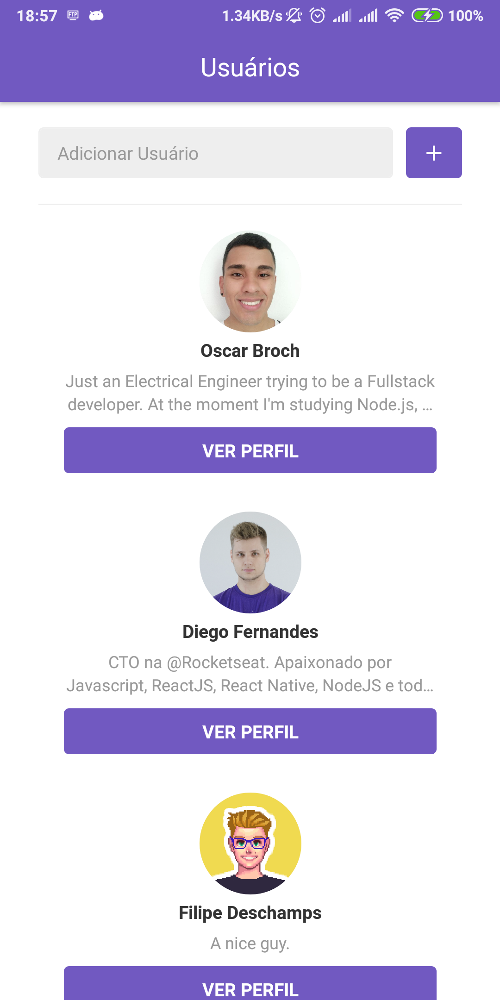
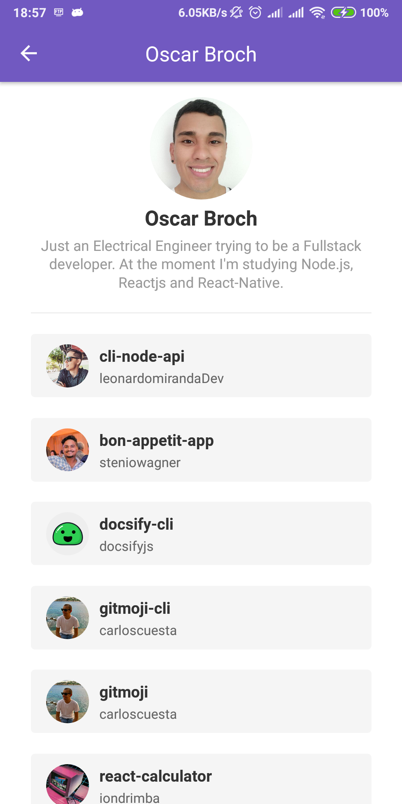
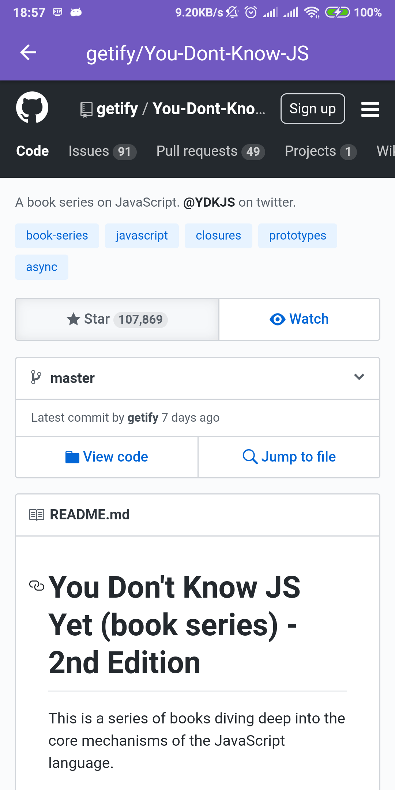

# Desafio 06. Aplicação com React Native

#### Ver desafio em [bootcamp-gostack-desafio-06](https://github.com/Rocketseat/bootcamp-gostack-desafio-06)

### Resultado 

## Entrega
“Só deseje as coisas as quais você está disposto a lutar”!
